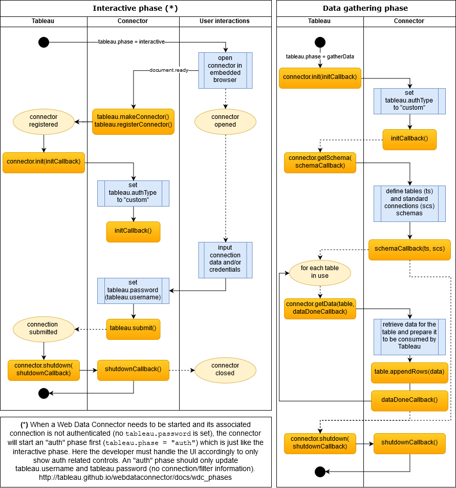

# Team Calendars for Confluence WDC (in development)

## Introduction

This is an attempt to create a Web Data Connector for Tableau that connects to Confluence's Calendar (not public) API.
The repository contains two main folders, one for the *connector* and another one for the *proxy*. Each of those are separate npm projects with their own dependencies.
There is a third folder called *shared* which contains resources used in both projects (mainly interfaces).

## Start here

1. Under the root folder, run the following scripts to install root dependencies and integrate shared resources to both the connector and the proxy folder structures.
```javascript
npm install
npm run init
```
2. Under the *connector* folder, run the following scripts to install dependencies for the connector project and to build the connector:
```javascript
npm install
npm run build
```
2. Under the *proxy* folder, run the following scripts (same as for the connector):
```javascript
npm install
npm run build
```
3. There is a *fake-api* folder. Use this app to fake a confluence API and play with the responses. It uses the same scripts as both the connector and the proxy:
```javascript
npm install
npm run build
```
## Connector lifecycle
This information is based on the official documentation available [here](http://tableau.github.io/webdataconnector/docs/wdc_phases).


